# Cursor Dynamic Rules System

Bu depo, Cursor için merkezi ve dinamik bir kural yönetim sistemi sağlar. Amaç; görev bağlamına göre doğru kural setini otomatik seçmek, zorunlu kalite kapılarını (quality gates) uygulamak ve tutarlı bir iletişim/uygulama standardı sağlamaktır.

## Özellikler (Kısa Özet)
- Dinamik kural seçimi (context-based) ve modüler component mimarisi
- Zorunlu ve sıfır toleranslı kalite kuralları (dosya boyutu, temiz kod, iletişim)
- Durum bazlı kural setleri (Basit Görev, Karmaşık Proje, Öğretim Modu, Acil Durum, Boyut İhlali)
- Windows 11 + PowerShell bağlamı ve GitHub izni kontrolleri

## Depo Yapısı
```
rules/
  core/
    clean-code-standards.mdc
    file-size-enforcement.mdc
    language-rules.mdc
  protocols/
    emergency-protocols.mdc
    mcp-tool-usage.mdc
  specialized/
    educational-approach.mdc
    quality-gates.mdc
  task-handling/
    codebase-analysis.mdc
    complex-project-management.mdc
    simple-task-handling.mdc
  rules.mdc  (Merkezi yönetim dosyası)
```

## Merkezi Dosya: `rules/rules.mdc`
- Ana kontrol düzeneğidir; bağlam tespiti (context detection), platform ve izin kontrolü, dinamik kural seti seçimi ve component yüklemeyi tanımlar.
- Zorunlu prensipler:
  - Kullanıcı iletişimi Türkçe, kod ve teknik içerik İngilizce
  - Dosya boyutu limiti: 700–1000 satır (700+ satırda yeni kod eklenemez)
  - Temiz kod ve kalite kapıları her zaman aktif

## Çekirdek Bileşenler (`rules/core`)
- `language-rules.mdc`: Kullanıcıya Türkçe iletişim, kodu İngilizce yazma standardı.
- `file-size-enforcement.mdc`: MUTLAK dosya boyutu kontrolü; 700+ satırda blokaj ve refactoring zorunluluğu.
- `clean-code-standards.mdc`: Unused import/ dead code temizliği, tek sorumluluk ilkesi, minimal uygulama.

## Protokoller (`rules/protocols`)
- `emergency-protocols.mdc`: Kritik durumlarda (security/production crash) sınırlı satır istisnası (+50) ve zorunlu sonrası refactoring.
- `mcp-tool-usage.mdc`: MCP araçlarının akıllı ve seçici kullanımı (sadece karmaşık/çok adımlı veya bilinmeyen teknoloji durumları).

## Uzmanlaşmış Bileşenler (`rules/specialized`)
- `educational-approach.mdc`: Öğretim odaklı, adım adım Türkçe açıklama; kod örnekleri İngilizce.
- `quality-gates.mdc`: Öncesi/sonrası kalite kapıları ve metrikler (file size, cleanliness, maintainability, vs.).

## Görev İşleme (`rules/task-handling`)
- `simple-task-handling.mdc`: Tek dosyalı/sade değişikliklerde hızlı uygulama.
- `complex-project-management.mdc`: Çoklu dosya, mimari planlama ve koordinasyon.
- `codebase-analysis.mdc`: İmplementasyondan önce zorunlu codebase analizi ve boyut denetimi.

## Dinamik Kural Setleri
- SET_001: Basit Görev → core + simple-task-handling
- SET_002: Karmaşık Proje → core + complex + analysis + mcp-tool-usage
- SET_003: Öğretim Modu → language + educational + clean-code
- SET_004: Acil Durum → language + file-size (esnek) + emergency + clean-code
- SET_005: Dosya Boyutu İhlali → language + file-size (tam blokaj) + analysis

## Zorunlu Kalite Kuralları (Zero Tolerance)
- Unused import, dead code, empty functions: Derhal kaldırılır
- Tek sorumluluk ilkesi ve minimal uygulama: Zorunlu
- Dosya boyutu: 700+ satırda yeni kod eklenemez (acil durum hariç, +50 satır sınırı)

## Çalışma Akışı (Özet)
1) Context Detection → Platform (Windows 11/PowerShell) → GitHub izin kontrolü
2) Dinamik kural seti seçimi ve component yükleme
3) Pre-implementation kontrolleri (dosya boyutu, import audit, kalite taraması)
4) Uygulama (gerekirse blokaj & refactor) → Post-implementation kalite doğrulaması

## Cursor Ayarı: User Rules (ZORUNLU)
Bu kural yapısının sorunsuz çalışması için Cursor içinde şu ayarı yapın:
- Settings → Rules, Memories... → User Rules
- Aşağıdaki içeriği eksiksiz yapıştırın ve kaydedin:
```
---
description: Kurallar yüklenmeden/kesinleşmeden kullanıcı talebi işlenemez; merkezi kural setiyle uyumlu kapı (gate).

# 🚨 KRİTİK İLETİŞİM KURALI
communication:
  tone: "realistic"
  principle: |
    ⚠️ Kullanıcı ile GERÇEKÇİ konuşulacak. 
    ❌ ASLA iyimser olunmayacak!
    ✓ Riskler açıkça belirtilecek
    ✓ Sorunlar net ifade edilecek
    ✓ Gerçekçi beklentiler sunulacak

globs:
  - "**/*"
alwaysApply: true
priority: 100
type: gatekeeper
enforcement:
  requireRulesLoaded: true
  blockIfMissing: true
  failMessage: |
    🛑 İŞLEM DURDURULDU
    ❌ Sebep: Kural setleri yüklenmeden kullanıcı talebi işlenemez.
    📋 Adımlar:
      1) Merkezi dosya `@rules.mdc` ve tüm component'leri yükle
      2) Zorunlu bileşenleri doğrula: file-size-enforcement, clean-code-standards
      3) Talebi tekrar çalıştır
policy:
  orderOfOperations:
    - "context_detection"
    - "platform_check_windows11"
    - "github_permission_check"
    - "load_central_rules_file"
    - "load_user_and_project_rules"
    - "select_rule_set_dynamically"
    - "validate_mandatory_components"
    - "process_user_query"
responses:
  blockedTemplate: |
    🛑 İŞLEM DURDURULDU
    ❌ Sebep: Kurallar eksik/yüklenmedi.
    📏 Dosya boyutu kuralı aktif (700+ satırda ek kod YOK).
    🔧 Gerekli aksiyon: Kuralları yükle ve zorunlu bileşenleri doğrula.
  warnTemplate: |
    ⚠️ UYARI: Kurallar kısmen yüklendi. Güvenli mod önerilir.
defaults:
  language:
    userCommunication: "tr"
    codeAndTech: "en"
  safeMode:
    enabledIfPartialRules: true
    behaviors:
      - "no_github_push_without_consent"
      - "no_file_growth_beyond_700_lines"
      - "remove_unused_imports_and_dead_code"
audit:
  postImplementationChecks:
    - "no_unused_imports"
    - "no_dead_code"
    - "single_responsibility"
    - "minimal_implementation"
    - "file_size_compliance"
```

## Kullanım
- Kuralları proje kökünde `.cursor/rules/` altında koruyun.
- Yeni görevde önce `rules/rules.mdc` içeriğine göre bağlam tespiti ve kural seti seçimini uygulayın.


## Lisans
Herhangi bir lisans bulunmamaktadır; isteyen dilediği gibi kullanabilir.

## Geliştirici
Bu kural sistemi Mehmet (Xenit) tarafından geliştirilmiştir. https://x.com/xenit_v0

---
Bu README, `rules/` altındaki merkezi ve modüler kural sisteminin kısa ve pratik bir özetini sunar.
# Cursor Kural Sistemi - Sistem Diagramı ve Açıklama

## 📊 Genel Sistem Mimarisi

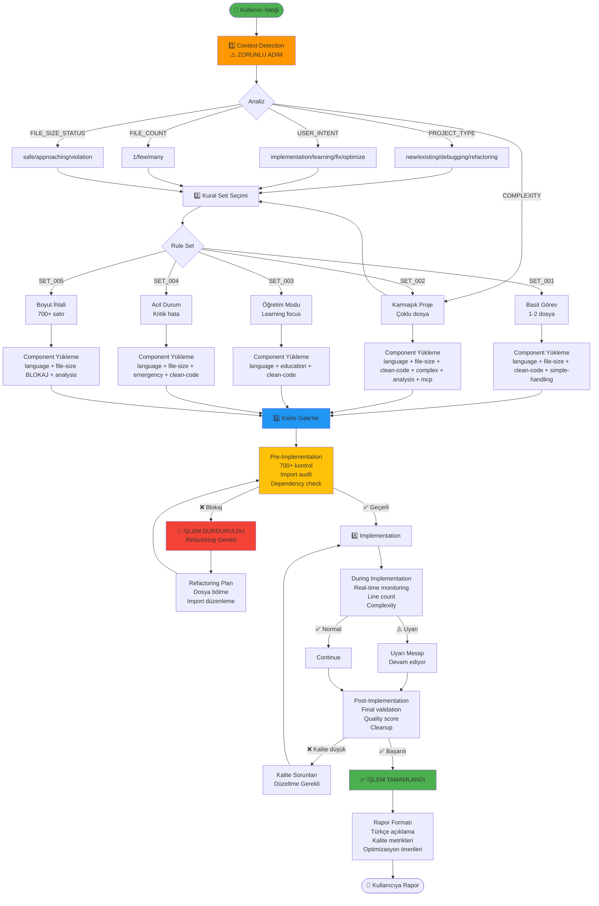

## 🧩 Component Yapısı ve İlişkiler

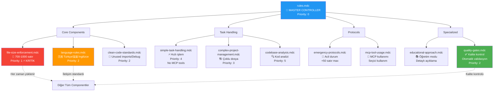

## 🔄 Context Detection Akışı

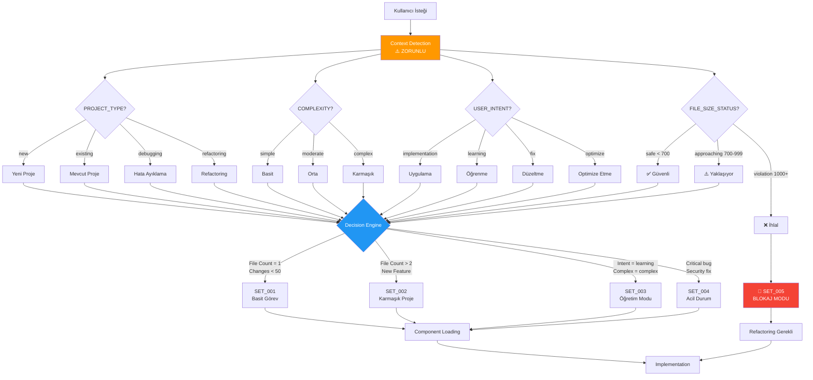

## ⚙️ Kalite Gate Mekanizması

```mermaid
flowchart TD
    Start([Implementation Başladı]) --> Gate1[Gate 1: Pre-Implementation]
    
    Gate1 --> Check1{Dosya Boyutu?}
    Check1 -->|≥ 700| Block1[🛑 BLOKAJ<br/>Refactoring zorunlu]
    Check1 -->|< 700| Pass1[✅ Geçti]
    
    Gate1 --> Check2{Kullanılmayan Import?}
    Check2 -->|Var| Remove[Otomatik Temizle]
    Check2 -->|Yok| Pass2[✅ Geçti]
    
    Pass1 --> Gate2[Gate 2: During Implementation]
    Pass2 --> Gate2
    Remove --> Gate2
    
    Gate2 --> Monitor1[Real-time Monitoring]
    Monitor1 --> LineCount[Satır Sayısı Takibi]
    Monitor1 --> Complexity[Karmaşıklık Takibi]
    Monitor1 --> ImportTrack[Import Değişikliği]
    Monitor1 --> CodeSmell[Code Smell Detection]
    
    LineCount -->|> Threshold| Warn1[⚠️ Uyarı]
    Complexity -->|> Threshold| Warn2[⚠️ Uyarı]
    ImportTrack -->|Critical change| Warn3[⚠️ Uyarı]
    CodeSmell -->|Detected| Warn4[⚠️ Uyarı]
    
    Warn1 --> Gate3
    Warn2 --> Gate3
    Warn3 --> Gate3
    Warn4 --> Gate3[Gate 3: Post-Implementation]
    
    Gate3 --> FinalCheck[Final Validation]
    
    FinalCheck --> Score[Quality Score Calculation]
    Score --> W1[File Size: 25%]
    Score --> W2[Cleanliness: 25%]
    Score --> W3[Maintainability: 20%]
    Score --> W4[Performance: 15%]
    Score --> W5[Documentation: 15%]
    
    W1 --> Total[Total Score: 0-100]
    W2 --> Total
    W3 --> Total
    W4 --> Total
    W5 --> Total
    
    Total -->|≥ 70| Pass[✅ PASS<br/>İmplementasyon Onaylı]
    Total -->|< 70| Fail[❌ FAIL<br/>Kalite Düşük<br/>Düzeltme Gerekli]
    
    Fail --> Fix[Fix Required]
    Fix --> Gate1
    
    Pass --> Report[📊 Rapor Oluştur]
    Report --> End([✅ İşlem Tamamlandı])
    
    Block1 --> RefactorPlan[Refactoring Planı]
    RefactorPlan --> Gate1
    
    style Block1 fill:#F44336,color:#fff
    style Pass fill:#4CAF50,color:#fff
    style Fail fill:#F44336,color:#fff
    style Gate1 fill:#FFC107,color:#000
    style Gate3 fill:#2196F3,color:#fff
```

## 📦 Kural Setleri ve Component Yükleme

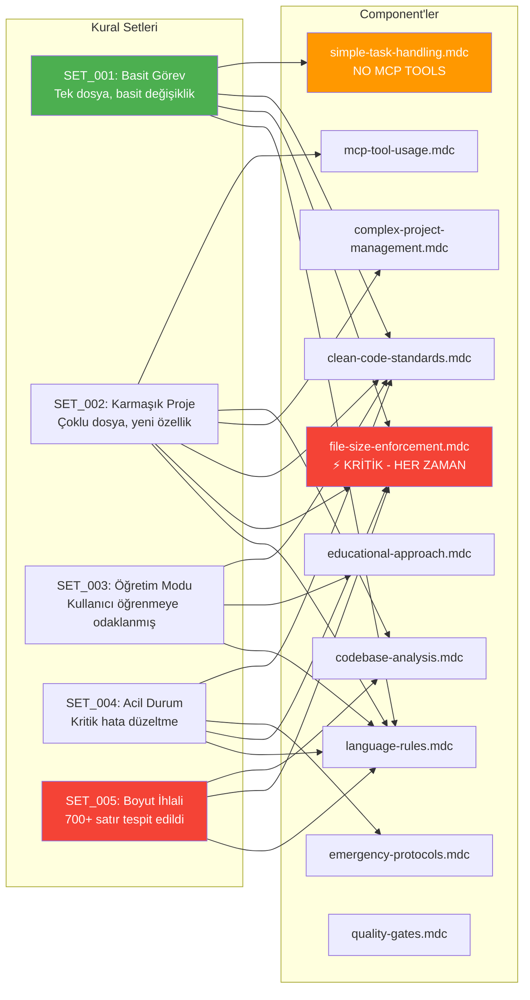

## 🎯 Öncelik Sırası ve Bağımlılıklar

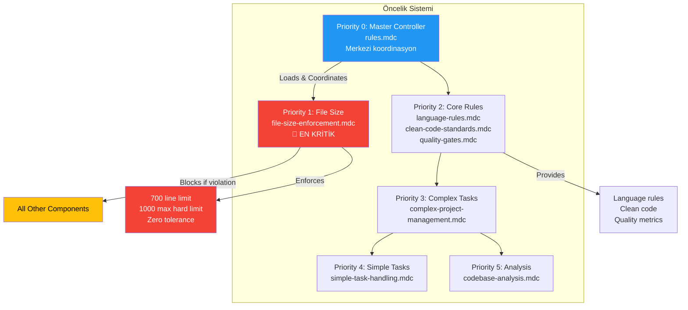

## 📊 Kalite Skorlama Sistemi

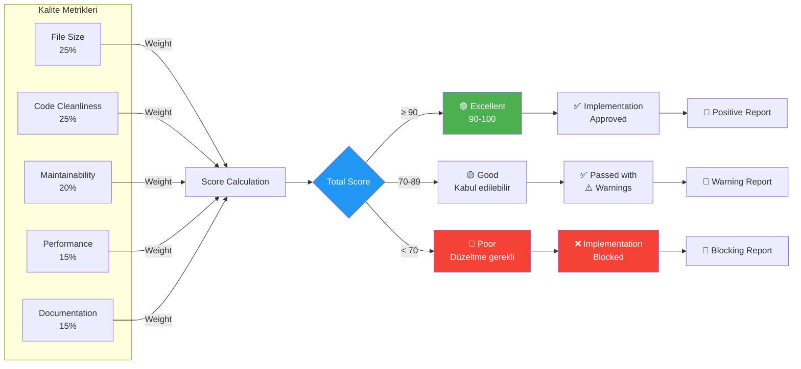

## 🔍 Dosya Boyutu Enforcement Detayı

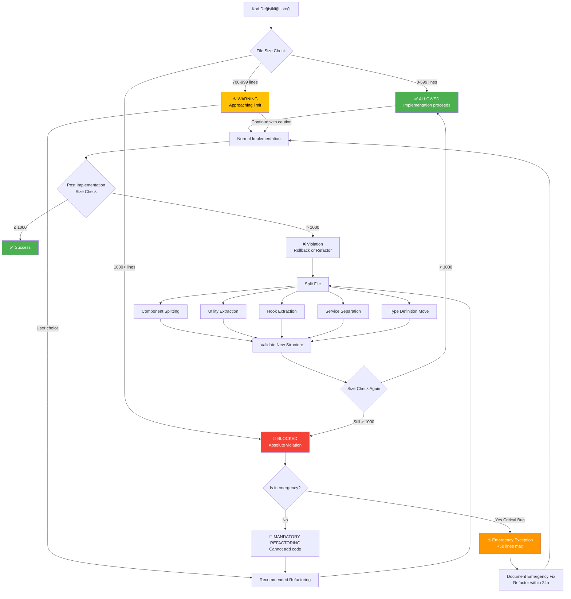

## 🎓 Öğretim Modu Akışı

```mermaid
flowchart TD
    Start([Kullanıcı Öğrenmek İstiyor]) --> Detect{Context Detection<br/>INTENT = learning<br/>COMPLEXITY = complex}
    
    Detect --> LoadEd[Load educational-approach.mdc]
    LoadEd --> LoadLang[Load language-rules.mdc]
    LoadLang --> LoadClean[Load clean-code-standards.mdc]
    
    LoadClean --> TeachingMode[🎓 Teaching Mode Activated]
    
    TeachingMode --> Explain1[1. Detailed Explanation<br/>Türkçe kapsamlı açıklama<br/>Nasıl çalışır?]
    
    Explain1 --> CodeExample1[2. Code Example<br/>İngilizce kod<br/>Best practices]
    
    CodeExample1 --> Explain2[3. Step-by-Step Guide<br/>Adım adım ilerleme<br/>Neden bu yaklaşım?]
    
    Explain2 --> QnA{Questions?}
    
    QnA -->|User has questions| Answer[Detailed Answer<br/>Ek kaynaklar<br/>İlgili örnekler]
    QnA -->|No questions| Continue
    
    Answer --> Continue[4. Implementation Guide]
    
    Continue --> Guide1[Implement with<br/>detailed comments]
    
    Guide1 --> Verify1[5. Verification<br/>Why this works]
    
    Verify1 --> TeachMore{More concepts?}
    
    TeachMore -->|Yes| Advanced[Advanced Topics<br/>Deep dive]
    TeachMore -->|No| Complete
    
    Advanced --> Complete[✅ Teaching Complete<br/>User learned concepts<br/>Ready to apply]
    
    Complete --> Report[📄 Educational Report<br/>What was learned<br/>Next steps<br/>Resources]
    
    style TeachingMode fill:#9C27B0,color:#fff
    style Explain1 fill:#4CAF50,color:#fff
    style Complete fill:#4CAF50,color:#fff
```

## ⚡ Basit Görev vs Karmaşık Görev Karşılaştırması

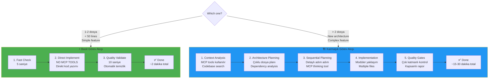

## 📋 İletişim Protokolü Akışı

```mermaid
flowchart LR
    subgraph Turkish[🇹🇷 TÜRKÇE İletişim]
        T1[Kullanıcı Açıklamaları]
        T2[Durum Bildirimleri]
        T3[Hata Mesajları]
        T4[Çözüm Önerileri]
        T5[Raporlar]
    end
    
    subgraph English[🇬🇧 İNGİLİZCE Kod]
        E1[Kod Yazımı]
        E2[Değişken İsimleri]
        E3[Dosya Adları]
        E4[Fonksiyon İsimleri]
        E5[API Documentation]
    end
    
    User[👤 Kullanıcı] -->|Türkçe Konuşur| Turkish
    Turkish -->|Açıklar| Explain[AI Açıklamaları<br/>Türkçe]
    
    Explain -->|Yazarken Kullanır| English
    English -->|Örneklerle Gösterir| Code[📝 Code Examples]
    
    Code -->|Türkçe Açıklar| Result[Sonuç: Hibrit İletişim<br/>✅ Kullanıcı dilinde öğrenme<br/>✅ Uluslararası kod standardı]
    
    style Turkish fill:#FF9800
    style English fill:#2196F3
    style Result fill:#4CAF50
```

## 🔗 Component Bağımlılık Ağı

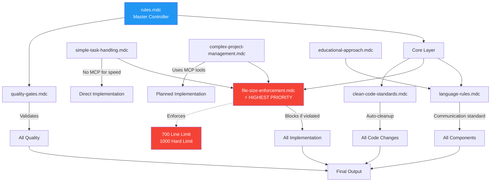

## 📈 Sistem Metrikleri ve Raporlama

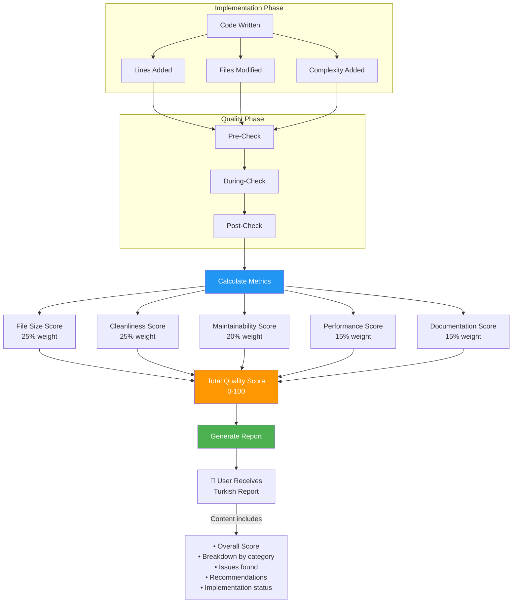

## 🎯 Özet: Sistem Nasıl Çalışır?

### 1️⃣ Context Detection (Zorunlu İlk Adım)
- Her kullanıcı isteğinde otomatik analiz yapılır
- Proje tipi, karmaşıklık, kullanıcı niyeti, dosya durumu belirlenir
- Bu analiz sonucuna göre kural seti seçilir

### 2️⃣ Rule Set Selection (Dinamik Yükleme)
- `SET_001`: Basit görevler (1-2 dosya, <50 satır)
- `SET_002`: Karmaşık projeler (çoklu dosya, yeni özellik)
- `SET_003`: Öğretim modu (detaylı açıklamalar)
- `SET_004`: Acil durum (kritik hata, +50 satır max)
- `SET_005`: Boyut ihlali (700+ satır, blokaj modu)

### 3️⃣ Component Loading (Modüler Sistem)
- Seçilen kural setine göre ilgili component'ler yüklenir
- `file-size-enforcement.mdc` her zaman yüklenir (en kritik)
- `language-rules.mdc` her zaman yüklenir (iletişim standardı)

### 4️⃣ Quality Gates (Çok Katmanlı Kontrol)
- **Pre-Implementation**: Dosya boyutu, import audit, dependency check
- **During Implementation**: Real-time monitoring, complexity tracking
- **Post-Implementation**: Final validation, quality score (0-100)

### 5️⃣ Enforcement (Mutlak Kurallar)
- Dosya boyutu: 700 satır → uyarı, 1000 satır → blokaj
- Unused imports: Otomatik kaldırılır
- Dead code: Otomatik temizlenir
- Single responsibility: Zorunlu

### 6️⃣ Reporting (Türkçe Açıklama)
- Kullanıcıya her zaman Türkçe açıklama yapılır
- Kalite skoru, metrikler, öneriler sunulur
- Kod örnekleri İngilizce standartlarda tutulur

## 🔑 Temel Prensipler

### ⚡ Performance
- Basit görevlerde MCP tool kullanılmaz (hız optimizasyonu)
- Sadece gerekli component'ler yüklenir
- Direct implementation tercih edilir

### 🎯 Quality
- Sıfır tolerans: Unused imports, dead code, empty functions
- Automatic enforcement: Kullanıcıya sorulmadan temizlenir
- Single responsibility: Her component tek görev yapar

### 📏 File Size (EN KRİTİK)
- Hard limit: 1000 satır
- Warning threshold: 700 satır
- Blokaj: 700+ satırda yeni kod yok
- Acil durum: Sadece kritik hatalar için +50 satır

### 🇹🇷 Communication
- Kullanıcı ile Türkçe konuşulur
- Kod İngilizce yazılır
- Raporlar Türkçe sunulur

## 📚 Kaynaklar

- [Cursor Rules Documentation](https://cursor.com/tr/docs/context/rules)
- Proje kuralları: `.cursor/rules/` klasörü
- Master controller: `.cursor/rules/rules.mdc`

---

*Bu diagram Cursor kural sisteminin nasıl çalıştığını görsel olarak açıklar. Sistem modüler, akıllı ve kalite odaklı bir yapıda tasarlanmıştır.*

